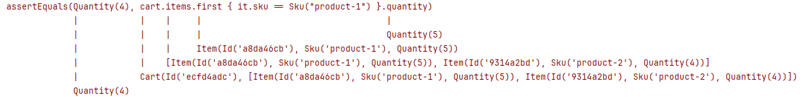

# Kotlin's Power-assert Plugin Demo


>  "A compiler plugin that writes detailed assert failure messages for you"

#### Example of a generated failure message


## Documentation

[📑 Kotlin's Power-assert compiler plugin](https://kotlinlang.org/docs/power-assert.html)

## Quick Start

#### Modify Cart Tests

- make a test fail by changing test data
- make a test fail by using invalid sku's or quantities
- activate ignored tests

#### Run Tests
```sh
./gradlew test
```

## Pros and Cons

- 👍 simplifies writing tests by automatically generating detailed failure messages for built-in `assert`
- 👍 reduced need for an assertion library and learning its API
- 👍 aids in debugging by breaking down long expressions and showing intermediate values


- 👎 can produce complex and overwhelming outputs
- 👎 assertion libraries offer more expressive APIs, which makes tests easier to read and write
- 👎 assertion libraries and custom asserts provide more tailored and helpful failure messages for complex assertions
- 👎 potential risk of over-reliance may lead to less clear and maintainable tests

## Similar Projects for other Languages (untested)

- The "original": [Groovy's Power Assert](https://groovy-lang.org/testing.html#_power_assertions)
- For Java: [jkschneider/java-power-assert](https://github.com/jkschneider/java-power-assert)
- For C#: [PowerAssert.Net](https://github.com/PowerAssert/PowerAssert.Net)
- For TypeScript: [power-assert-js/espower-typescript](https://github.com/power-assert-js/espower-typescript)
